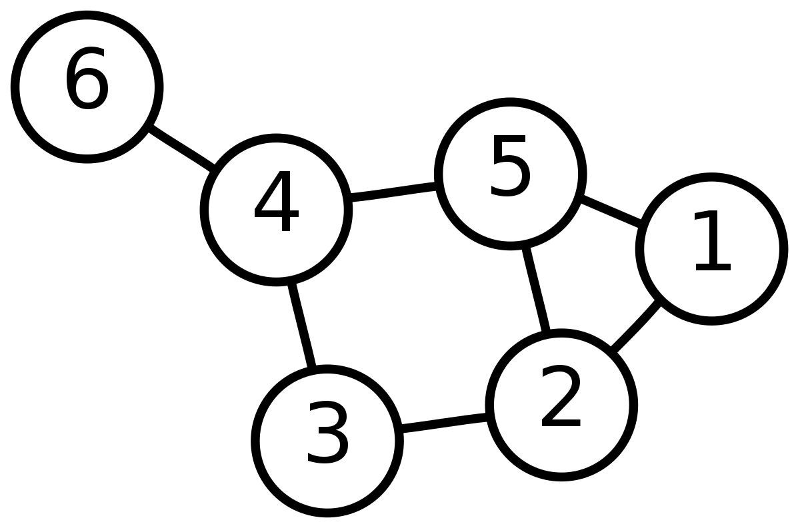

# 🔗 Core Exercise: Graph Iterator

You will need to fill in [`blog.md`](/blog.md) for this activity. Put your answers to the question inside of it.

# Background

The Iterator Pattern allows us to traverse a data structure whilst maintaining the abstraction of the data structure's underlying details. An iterator is a black-box that we can keep asking to give us elements, until it runs out. This occurs in a _linear_ fashion (we ask for elements one at a time), and the Iterator Pattern hence allows us to _linearise_ any data structure.

For `Set`s, `ArrayList`s and plenty of other data structures this is all very well because the ADT itself is already linear, conceptually. But what about something that's non-linear, like a graph? So long as we have some sort of sequence to accessing elements of the data structure, we can build an iterator.

In this exercise, you will be using the Iterator Pattern to write two iterators - one which traverses a graph using **Breadth-First Search** and one that traverses a graph using **Depth-First Search**.

Inside [`src/main/java/graph/Graph.java`](/src/main/java/graph/Graph.java), we have written a Generic `Graph` class which models an undirected graph using an **adjacency list** with a `HashMap`. To recall, an adjacency list stores the graph in the following format:

```
Node : [ All the nodes the node is adjacent to ]
```

# BFS

Create a new class called `BreadthFirstGraphIterator.java` that uses BFS to traverse a graph, given that graph and a starting node. Each subsequent call to the `next` method should 'tick' the BFS by one (i.e. the next element is looked at). You may not pre-traverse the graph and store the nodes to visit in an `ArrayList` or similar and simply pawn off the job to that.

BFS Pseudocode:

```
queue = []
visited = set()
while queue:
    vertex = queue.dequeue()
    visited.add(vertex)
    queue.extend(graph.get_adjacent(vertex) - visited)
```

Inside [`Graph.java`](/src/main/java/graph/Graph.java), write a method called `breadthFirstIterator` which returns a new BFS iterator.

# DFS

Create a new class called `DepthFirstGraphIterator.java` that uses DFS to traverse a graph, given that graph and a starting node. Each subsequent call to the `next` method should 'tick' the DFS by one (i.e. the next element is looked at). You may not pre-traverse the graph and store the nodes to visit in an `ArrayList` or similar and simply pawn off the job to that.

Inside [`Graph.java`](/src/main/java/graph/Graph.java), write a method called depthFirstIterator which returns a new DFS iterator.

If you need to brush up on Graphs, here are a few links to COMP2521 lectures:

- [Graph ADT](https://youtu.be/4s_3uirIGM8?si=YZIQBiev6PeUSs5V)
- [Graph Implementations](https://youtu.be/2hbR-aez1E4?si=SjRyidntyi5GpEMH)
- [Graph Traversal](https://youtu.be/DzdztZboQ6w?si=HmuvOfv260pVZRVI)

Some simple tests have been provided for you inside [`GraphTest.java`](/src/test/java/graph/GraphTest.java), they don't currently compile as the Iterator classes themselves do not exist.

The second test uses this Graph:



<details>
  <summary>Hint</summary>
  <ul>
    <li>You will not be able to use recursion to do the DFS.</li>
    <li>
      Java provides collections which will help you with the implementation of
      the algorithm.
    </li>
  </ul>
</details>

# Iterators & Iterables

Change the definition of `Graph` so that it is `Iterable`. By default, the graph will traverse itself using a BFS, starting with the first node that was added to the graph. Write a test for this that loops through a graph.

Inside your blog post, answer the following questions:

**Do you think making the `Graph` `Iterable` makes semantic sense? Discuss briefly, and think of both sides.**

**We could change the definition of our `Graph` so that the traversal logic is done internally, i.e:**

```java
public class Graph<N extends Comparable<N>> implements Iterable<N>, Iterator<N>
```

**Is a `Graph` an iterator or an iterable in this case?**

<details>
  <summary>Hint</summary>
  <ul>
    <li>Would I be able to set the graph to a variable of type Iterable? <code>(Iterable&ltN&gt)</code></li>
    <li>
      Would I be able to set the graph to a variable of type Iterator? <code>(Iterator&ltN&gt)</code>
    </li>
  </ul>
</details>

**What would the `.iterator` method return in this case?**

<details>
  <summary>Hint</summary>
  <ul>
    <li>
      If the graph is its own iterator since it
      <code>implements Iterator</code>, then what might the method that returns
      a graph iterator actually give us?
    </li>
  </ul>
</details>

There is a problem with this approach though. Inside your blog post, describe a test that would cause this implementation to fail.

<details>
  <summary>Hint</summary>
  <ul>
    <li>
      If a data structure can give us an iterator, then each time we request
      one, we should get an independent iterator. If the iterators weren’t
      independent, then think of an example of some code that wouldn’t work the
      way we expect it to, if we are assuming the iterators are independent.
    </li>
  </ul>
</details>

# Iterator Invalidation

I decide to use the graph as part of a game I’m working on. In this game I have pieces with a certain score. These pieces are represented by the nodes in the graph. The edges in the graph aren’t too important in my game at the moment, but they will affect the order in which turns are taken, as the graph topology affects which nodes are visited before others. I want to compare every node in my graph with every other node, removing the second node from the graph if it is smaller than the first. I chose to do this in a nested for loop, but I end up getting an error I can’t quite debug. Why might this be happening?

**Investigate the code and in your blog, describe why this error occurs/why the code doesn’t work as expected.**

> You do not need to write code to fix this bug

<details>
  <summary>Hint</summary>
  <ul>
    <li>
      If you’re not sure why the error occurs or why the code doesn't work as
      expected, try running the <code>listInvalidation()</code> method instead.
      This works very similarly to the graph example, but java spits out a
      specific error. Google this error to get a better idea of what the problem
      with the <code>graphInvalidation()</code> method is
    </li>
  </ul>
</details>
